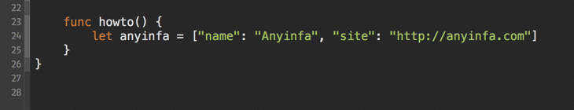
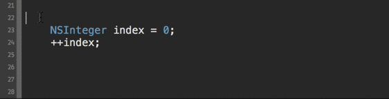
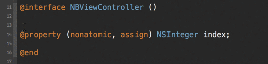
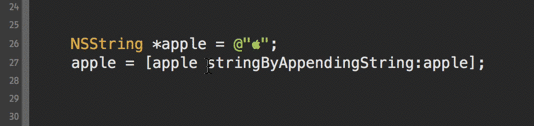
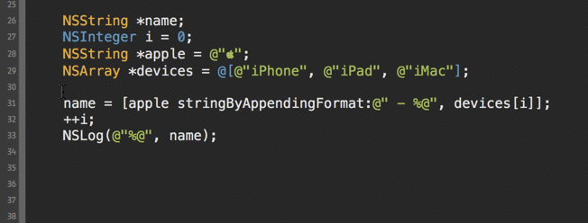

XcodeHoney
==========

####Version 0.1

## Description

Plugin for Xcode to add some useful key bindings. Support Xcode 6 beta.

## Installation

Clone __XcodeHoney__ from github or download from [HERE](https://github.com/anyinfa/XcodeHoney.git) directly. Open XcodeHoney.xcodeproj and then Build. The installation is now completed. Very simple.

>git clone https://github.com/anyinfa/XcodeHoney.git

##Uninstall

Enter __Plug-ins__ directory

>/Users/[YOUR\_USER\_NAME]/Library/Application Support/Developer/Shared/Xcode/Plug-ins

Delete __XcodeHoney.xcplugin__ file.

##Usage

###⌘ + return

If you are use Xcode 6 to write Swift code, anywhere in the line, press __⌘ + return__, XcodeHoney will automatically insert a new line without ';'.

###⌘ + ;
Anywhere in the line, press __⌘ + ;__, XcodeHoney will automatically move the cursor to the end of the line, insert ';', then start a new line.

__Note:__ This shortcuts will override Xcode's default behavior __Syntax checking__ of __⌘ + ;__.

###⌘ + -
Add a single-line comments.

###⌘ + =
Add a double-line comments.

###⌘ + '
Anywhere in the line, if no text is selected, XcodeHoney select the current row then double it. If some text is selected, XcodeHoney double it directly.

##Future

I will add a panel for you to custom shortcuts for execute a combination of commands.

##Contact me

If you have any suggestions, please send me an Email. Your suggestions are welcome.

Email: [anyinfa@gmail.com](anyinfa@gmail.com)
